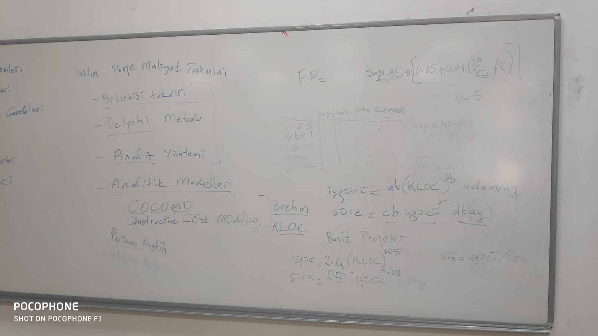

# Software Project Management 

## Puanlama 

|tip | oran |
|---|---|
|Ara sinav| 30 |
|Proje|25|
|odev|5|
|final|40|

## Ders Notları 

## 08.10.2019
for **project success** we need to check three thingstime to accure the best quality: 

1. budget 
2. requirements (scope)
3. time 

**Software proeject management** we need to chekc three things as well : 

3P  (Sofware develeopment model )

* problem 
* proccess 
* peopele 
* what kind of people we have: proejct manager, software analyst, softwarere negineering, database and * network.
* product 
* ERP or Operating system software and what kind of sotware we need. 

Project managment raod-map ==> step by step 

1. understanding the proejct 
	1. background 
	2. the palyer -> clients priorities : time budget requirements 
2. defning the project 
	1. project deliverable 
	2. proejct scope 
	3. review? approved
	4. client team? --> user, sponsor, 
3. planning the porject 
	1. lists porject activities 
	2. dependecy between activities 
	3. estiamate time, effort
	4. assigned resources (hardware, software, effort, pepole)
	5. Project schedule ==> examples like grant diagram, pert and MS-Project 
	6. team orgnisation
	7. quality plan 
	8. risk plan 
4. running the proejct 
5. closing the proejct 
She draw spiral model 
    Bring it from google 

Work breakdown structure

1. Prortype: 
	1.     customer (#@$)
	2.     planning 
	3.     risk
	4.      desgin   
	5.     construct 
	6.     customer
2. product 
	1.     C
	2.     P
	3.     RA    
	4.     D
	5. C
	6. C
3. Advanced prdouct 
	1. Stuff will be used here as well 
	2. 
4. MAinaiatnes 

information system project management jolyon hallow book.

1. Project deliverable 
	1.  planning 
		1. project plan
		2. Statement of work (SOW) 
		3. cost benifits 
		4. project schedule 
		5. Budget
	2. Desgin
		1. data model
		2. process model
		3. data dictionary
		4. bsuiness rules 
	3. question deilverablity
	4. Developments/implemenation 
		1. code, unit test, plan, report , intgeritiy ,system
		2. training plan

Pay Back --> after what time and what can we do ,2 years net preenst value .

##  15.10.2019
Change request Form  (note that she is reading from the book reading the book is much better than just listening to her) 
The form strucutre will have the next details: 

- date 
- Project manager 
- requested by 
- description of change 
- impact on
	- project
	- schedule 
	- costs 
- resption
- date required 
- data 
- approved/rejected 
project Scope Change. 

**Planning:** 

1. proejct assumention and constiaints 
2. project activities ]
3. connection between activities 
	1. STart finishL start>>>fnish --> show on grant diagram.
	2. finish start: 
	3. finish finish 
	4. start start (gantt diagram)

Sure ve islem 
(ag analizleri) 
pert Project evaluation and review teq.
CPM ctricila path methods -- log time 

**Water fall project activites(WBS - work break down structure)**

1. PLannng 
2. reguirements analysing 
	1. collecting data 
	2. modeling 
	3. documenting SRS
3. desgin
	4. Geeneral desgin 
	5. detaield desgin 
		1. database desgin 
		2. interface desgin 
		3. result/report desgin 
		4. process desgin
4. implementing 
	6. coding 
	7. creating database 
5. test
	8. engineering test 
	9. user test 
		1. birim test 
		2. butenelmeme testi
		3. sistem test 
		4. kullnici testi 

LAg time = activity time : best case, worst case, average case 

## 22.10.2019

Project planning 

- Kabul ve kisitlar
- projedeki aktiveteler listesi 
- aktivitlere arasindaki baglilik : finish start- start strart - finish finish (bir is baslayip ikiknisi baslar, ayni zamanda baslamasi, bitmesi , ) 
- En optimum yol, CPM Pert
- Gant diyagrami ile yapilir 
- gereken is gucu (her bir aktivite icin) toplam isgucu 
	- Goreb tipi :
		- L.A.
		- S.A
		- P.Y.
		- DW 
- gorev atama (assıgnıng and leveleıng resources * kaynak)
- Butce 
- SLack Time 
- Risk planlama (risk yontemi) 
- Ekip yonetimi 
- Kalite plani/planlama
- Gereken sure
	- aligning the schedule 
		- sure mutlak mi? ek sure? 
		- segement into release 
		- reduce functionality
		- additional stuff 
		- subconstracting 
- Risk yonetimi: 
	- risk belirleme 
	- risk planlama 
	- risk izleme 
	- risk raporlama 
- Risk tipler 
	- perosnal riski
		- isten ayrilma 
		- zaman ayirmama 
		- plana gore (calisan yeresizligi) 
		- yetenek ekiskligi 
		- egitim eksikligi 
	- isletemcilik riski 
		- dagitim teslim tarihi 
		- ilisikili projeler
		- 
	- musteri riski
		- eski musteri mi? 
		- reviews suresi 
		-  
	- surec riski
		- yazilim gelistirme adimlari 
		- yeni surec tanimi 
		- Yazilim Muhendisligi  standartlari  
	- gelistirme ortami ve altyapi
	- genel riskler 

Risk tablosu: 
rsik tanimi, risik tipi, olasilik, etkisi, onemi
Rısk tanımıö onnemı öonlemı, maliyeti.

Risk plan tema: risk izleme milestrones 
risk izleme ekibi 

On inceleme ve feasibility : WBS (work braek down structure) 
Waterflow, sprial 

## 05.11.2019

P.M road map 

1. understanding 
2. defining 
3. planing --> project planning 
4. running 
5. closing 

Project planning: 

- proect assumptions and constrians 
- Software development model 
- activities : 
	- requeirmenet analysis 
	- desgin 
	- implementiaion 
	- test
	- WBS 
- Dependecies between activicites
	- FF (f = finish , s = start)  
	- FS
	- SS 
- Estimapte of work required 
	- R.A. 
	- adam/ny effort 
	- desgin efofrt 
	- implementation effort 
	- coding, database effeort 
		- Totoal Adam/ny 

PERT - project eveletuion and R techniguqes 
Gantt 

Pert 
Gant - time, work , assign 
resources : SE , people  --> leveling 
Milestones 

waterfall - based on them? 
budget? 

Risk planning

- staff (people) risks 
- Equipment 
- Clinet risks 
- Scope risks 
- Technolgoy risks 
- Physical risks 

Example of risk table:

|Risk | Category | proablity | Impace | Degree (impact* probality) |
| --- | --- | --- | --- | --- |

Quality planning 

Standard 

Review 

inspection 

version control

 continue 

orgnisations communication 

confguration managment 

= project running, closing the difference? 
write a report of project and what happened 

Proje nedir 

proje yonteimi nedir, 

onemli konular 

## 17.11.2019

Seflik sistemi 
Demokratik sistemi 
Hirasik ekip

Proje yoneticisi: 
    Destek
    Sistem analisleri 
    yazilim gelistirici 
    Test ekip

fonkisyonel 
proje ekibi 

## 26.11.2019

Kaliteli yazilim saglamak 

- Standart 
- yazilim gelistirme surec modeli
- sertfikali ekib 
- gozden gecirme review 
- inspection - inceleme 
- test 
- yazilim olcumu 
- SCM 
- SRM 

SPICE 
Capability Maturity Model Integration (CMMI)  
(KPA  , Key process area) 

- Baslangic
- Managed  
- Proje plan Gereksinim nalaizi 
- yazilim kongrasyon yonetimi 
- tasarim belgesi
- Defined
- kurumsal yapida proje yonetimi 
- risk yonetimi 
- gereksinim yontetimi 
- quatnitfiy managed 
-     saysial proje yonetimi
- optimizify
- feedback
- yaraticilik
- yonilik  
People CMM 

Software metrics 

Software metrics 
Büyüklük

- Line of code (satır sayısı) kloc loc, k = öne thousand
- FP 
Tasarım 
- Algoritma karmaşıklığı
- Nesne yönelik yaklaşımı 7 ölçüm birimi var
- Ck. Metrics (chidamber-kemerrer)
- Döngüsel karmaşık (cyclomatic complexity) (mcCabe) 

Etkin programlama kuralları 

Program içindeki 

Kalite faktörleri mcCall

Hesaplanma arifmetikleri işlem yoğunluğu
Halstead 

## 03.12.2019

Yönetim kalite sistemi

- Formal yontem, ygs modelleri 
- Standartlar
- Yetkinlik belgeleri 

GG - milestone 
Incelem - static verification (değerlendirme) 
Test - dinamik geceleme (doğrulama) validation (verification) 

Yazılım ölçütleri 

- Büyüklük (loc, FP) 
- Karmaşıklık
- Döngüsel karmaşıklığı (gemotry complexity) McCabe
- arithmetic hesaplama (halstaal)
- McCull kalite değerleri/faktörleri, 
- CKM metrics for OOP
Yazilim Konf. Yö.
Birimleri tanımı 
Şef. Conf. Identification
Değişiklik konfederasyon kontrolö change contoel 
Raporlama, static reporting

Sürüm yönetimi, 
Release management - release management cycle (drawing) 
8 leveled circle 

## Son ders 
Proje yonetimi: 

- proje anlasmasi: 
	- fizibility analizi 
	- teknik fizibility  
	- Ekonomik fizibilitesi 
- proje tanimlammasi
	- teslim erilecek
	- alan (kapsam) tanimi
	- Alan degisikligi formu 
	- Y.G surec modeli
- proje planlanmasi
	- Kabul ve kisitlar
	- risk 
	- is adimlari
	- WBS 
	- PERT 
	- Gant - adim ay butce ekis orgnasiyo 
	- kalite plani 
- gerceklestirme, kontrol izlenmesi 
- kapanis 
  
Proje nedir? 
yonetim, proje yonetimi, Y.M, B.m. YPY.

Yazilim buyukluk
LOL, Kloc , FP 
Maliyet tahmini 

butce kalemleri: 

- personel giderleri 
- Donanim ve arac giderleri
- danismanlik
- seyahat giderleri 
- alt yuklemcisi 
- diger 

